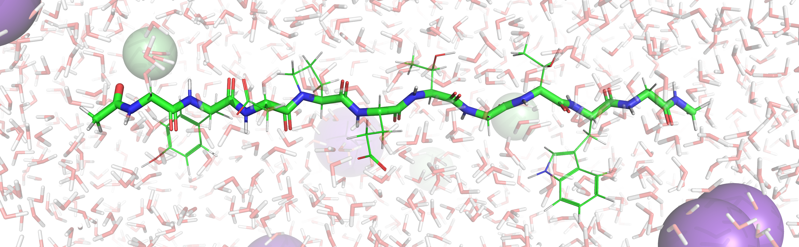

  

# Repozitář MD simulací

Vítejte v repozitáři simulací pro kurz molekulárního modelování a vizualizace.
Tento prostor slouží jako knihovna simulačních dat, kde se naučíte ovládat
PyMOL, analyzovat dynamiku biomolekul a vytvářet vědecké ilustrace.

## Dostupné simulace

|Systém|Téma|Odkaz|
|:-:|:-:|:-|
|__Chignolin__|Sbalování vlásenky proteinu, porovnání RMSD|[Odkaz](./chignolin)|
|__DNA + barvivo__|Interakce fluorescenčních barviv DNA s dvoušroubovicí DNA|[Odkaz](./dna_binder)|

> [!TIP]
> Začněte stažením .zip balíčku v příslušné složce, který obsahuje všechna
> potřebná data (topologii i trajektorii, popřípadě další soubory potřeba k
> řešení). Detailní zadání úkolů najdete přímo v README.md dané složky.

Návody a úkoly najdete v každé složce repozitáře.

## Použité programy

K vypracovaní úkolů jsou potřeba následující nástroje:
- __PyMol__: zobrazení strukturních dat
- [__RCSB.org__](https://rcsb.org)
