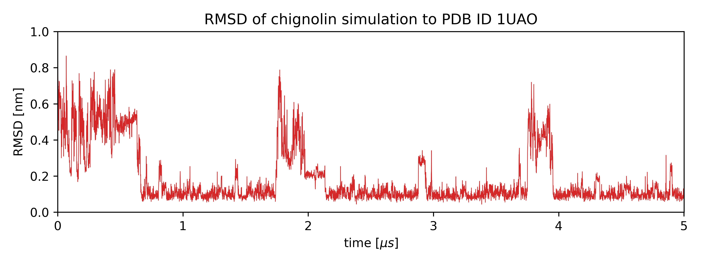

# 🧬 Simulace: Chignolin (CLN025)

Chignolin je nejmenší protein s jasně definovanou strukturou ($\beta$-hairpin), což z něj dělá ideální model pro pochopení sbalování proteinů.

## 1. Stažení simulace
*Klikněte na zelené **"<> Code"** a stáhněte .zip **"Download ZIP"**.*
Extrahujte .zip soubor. ve složce najdete topologii, trajektorii a graf RMSD.

Simulace se obvykle ukládají jako dvojice souborů:
- **Topologie** (`.pdb`) obsahuje informace o atomech (atomové typy, vazby, ...).
- **Trajektorie** (`.dcd`) obsahuje souřadnice atomů pro několik snímků.

Různé simulační programy zapisují topologii i trajektorii různě:
|Program|top|traj|
|:-|:-:|:-:|
|AMBER|.prmtop|.traj / .nc|
|Gromacs|.tpr|.xtc|
|CHARMM|.psf|.dcd|
|OpenMM|.pdb|.dcd|

## 2. Načítání simulace
Aby simulace fungovala, musíte soubory načíst ve správném pořadí:

1. **Načtěte pdb:** přetáhněte soubor `.pdb` do okna pymol nebo použijte `File -> Open`.
2. **Načtěte dcd:** přetáhněte soubor `.dcd` do okna pymol nebo použijte `File -> Open`.

trajektorii je potřeba načíst vždy až po topologií, aby se pohyb přiřadíl k správným atomům.

## 3. Příprava simulace

**Spusťte simulaci**. V pravém dolním rohu uvidíte ovládací panel (tlačítko play).
protein a ionty soli se budou rychle pohybovat. Pro lepší přehlednost odstraníme ionty.
> Během simulace je protein obklopený vodou, ukládání souřadnic pro simulace k analýze většinou ale není užitečné.
Mazání vod snižuje velikost trajektorie z 204 MB na 9.9 MB, protože ukládame jen souřadnice 165 atomů, celý systém obsahuje 8927.

```python
remove ino  # odstranění iontů kolem proteinu
zoom        # přiblížení
```

**Spusťte simulaci**. Protein se bude velmi rychle pohybovat a otáčet, protože během simulace ve vodě volně difunduje.
Přeložením jednotlivých snímků přes sebe pomocí `intra_fit` translaci i rotaci zastavíme. Hektický pohyb vyhladíme příkazem `smooth`:

```python
intra_fit polymer
smooth  # interpolace pohybu
```

Nyní máme připravenou simulaci tak, abychom si ji mohli prohlédnout.

## 4. prohlížení simulace

Postupně si zobrazte molekulu v různých zobrazení:

```python
as cartoon
# nebo
as sticks
# nebo
as sticks, bb.
```

## 5. Úkoly

1. Prohlédněte si celou simulaci. Co lze pozorovat?

1. Porovnejte chování proteinu s průběhem hodnot RMSD v následujícím grafu (`chignolin-rmsd.png`).  

   >RMSD (Root Mean Square Deviation) je průměrná vzdálenost atomů (jendotka Å nebo nm) od nějaké referenční struktury, v tomto případě je to struktura s PDB ID 1UAO.

   $$RMSD = \sqrt{\frac{1}{n} \sum_{i=1}^{n} (x_{i,REF}-x_{i,SIM})^2}$$

    

1. Ve stejném okně si stáhněte tuto referenční strukturu a porovnejte ji se strukturou ze simulace.
   Vytvořte objekt jen z první struktury ensemblu:
   ```python
   create exp, 1uao, 1  # , 1 znamená, že kopírujete první strukturu z 18
   delete 1uao  # původní objekt už nepotřebujeme, máme novy objekt 'exp'
   # přeložení trajektorie a reference
   extra_fit polymer  # polymerní části v3objektů
   extra_fit bb.  # páteře objektů
   ```

1. Znovu se podívejte na simulaci a graf RMSD.

1. Zobrazte si vodíkove vazby, které se během simulace vytvoří.
   ```python
   dist hbonds, chignolin, chignolin, mode=2
   ```

   >Jestli při přenastavování zobrazení vazby zmizí, spusťte příkaz `as dashes, hbonds`
