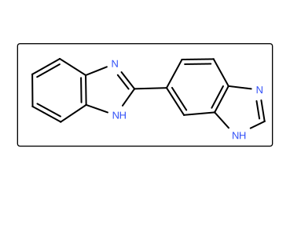

# 🧬 Simulace: Vazba fluorescenčních barviv DNA

Barviva Hoechst jsou skupina fluorescenčních barviv používaných v molekulární
biologii k barvení DNA. Tato barviva se preferenčně vážou do malého žlábku
(minor groove) DNA. V této simulaci prozkoumáme, jak se deriváty těchto barviv
vážou a interagují s DNA duplexem a porovnáme vazebné módy s experimentem.

## 1. Stažení simulace

Simulace se obvykle ukládají jako dvojice souborů:
|Soubor|Funkce|
|:-:|:-|
|**Topologie** (`.pdb`)| obsahuje informace o atomech (atomové typy, vazby, ...).|
|**Trajektorie** (`.dcd`)| obsahuje souřadnice atomů pro několik snímků.|

Stáhněte si .zip soubor [__`zde`__](https://github.com/jansa249/sims-for-students/raw/refs/heads/main/dna_binders/dna_binders.zip?download=).
Extrahujte .zip soubor. Ve složce najdete topologii, trajektorii a graf RMSD.

Různé simulační programy zapisují topologii i trajektorii různě:
|Program|top|traj|
|:-|:-:|:-:|
|AMBER|.prmtop|.traj / .nc|
|Gromacs|.tpr|.trr / .xtc|
|CHARMM|.psf|.dcd|
|OpenMM|.pdb|.dcd|

## 2. Načítání simulace
Aby simulace fungovala, musíte soubory načíst ve správném pořadí:

1. **Načtěte pdb:** přetáhněte soubor `.pdb` do okna pymol nebo použijte `File -> Open`.
2. **Načtěte dcd:** přetáhněte soubor `.dcd` do okna pymol nebo použijte `File -> Open`.

<!-- Trajektorii je potřeba načíst vždy až po topologií, aby se pohyb přiřadíl k správným atomům. -->
> [!TIP]
> **Pamatujte:** Vždy načítáme nejdříve topologii (`.pdb`), až potom trajektorii (`.dcd`).


## 3. Příprava simulace

**Spusťte simulaci**. V pravém dolním rohu uvidíte ovládací panel (tlačítko play).
Ionty soli se budou rychle pohybovat. Pro lepší přehlednost odstraníme ionty.
<!-- > Během simulace je protein obklopený vodou, ukládání souřadnic pro simulace k analýze většinou ale není užitečné. -->
<!-- Mazání vod snižuje velikost trajektorie z 204 MB na 9.9 MB, protože ukládame jen souřadnice 165 atomů, celý systém obsahuje 8927. -->

```python
remove ino  # odstranění iontů kolem proteinu
zoom        # přiblížení
```

**Spusťte simulaci**. Protein se bude velmi rychle pohybovat. 
Hektický pohyb vyhladíme příkazem `smooth`:

```python
smooth  # interpolace pohybu
```

Nyní máme připravenou simulaci tak, abychom si ji mohli prohlédnout.

## 4. Prohlížení simulace

Postupně si zobrazte molekulu v různých zobrazení:

```python
as cartoon
show sticks, organic
# nebo
as lines
```

## 5. Úkoly

1. Prohlédněte si celou simulaci.
    - Co lze pozorovat?
    - Jaké různé způsoby vazby ligandu na DNA existují?
    - Jaké části nebo skupiny molekul k interakcím přispívají?  

1. Identifikujte ligand v simulaci.
   Na stránce [RCSB.org](https://www.rcsb.org/search/chemical) v chemickém vyhledávání nakreslete nějakou podstrukturu ligandu.
    > Neměla by být příliš malá, (benzenové jádro je skoro všude), ani příliš velká.

   <details>
   <summary><b>Zobrazit nápovědu</b></summary>

   Nakreslete tuto strukturu.

   

   </details>

   V možnostech vyberte __Substructure (including Stereoisomers)__ a stiskněte tlačítko __Search__.
   Pod okýnkem se Vám zobrazí podobné struktury. Najděte správnou z nich.

   <details>
   <summary><b>Zobrazit nápovědu</b></summary>

   __Molekulová hmotnost = 424.498__

   </details>

   Klikněte na záznam v databázi. Pod názvem molekuly vpravo najdete __Find Related PDB Entry__. Stiskněte __search__. Zobrazí se Vám listina struktur, které obsahují tento ligand.

1. Porovnejte chování ligandů v simulaci s experimentální strukturou.  
    Stáhněte si první strukturu z listiny z předchozího úkolu.

    ```python
    fetch [PDB ID STRUKTURY]
    extra_fit polymer.nucleic  # přeloží přes sebe struktury DNA
    ```

    Které z navštívených vazebných míst v simulaci odpovídá experimentu?

1. Zobrazte si vodíkove vazby, které se během simulace vytvoří mezi DNA a ligandem.
   ```python
   dist hbonds, organic, polymer.nucleic, mode=2
   # mode=2 počítá jen vzdálenosti polárních skupin
   ```

   > [!TIP]
   > Jestli při přenastavování zobrazení vazby zmizí, spusťte příkaz `as dashes, hbonds`

1. Vytvořte obrázek obsahující DNA a jen ligand vázaný na správné místo.
    Zvolte zobrazení `spheres`, odstraňte vodíky a zabarvěte atomy uhlíku DNA a ligandu různě.

    Znovu se podívejte na simulaci v tomto zobrazení a sledujte mobilitu částí molekuly.

